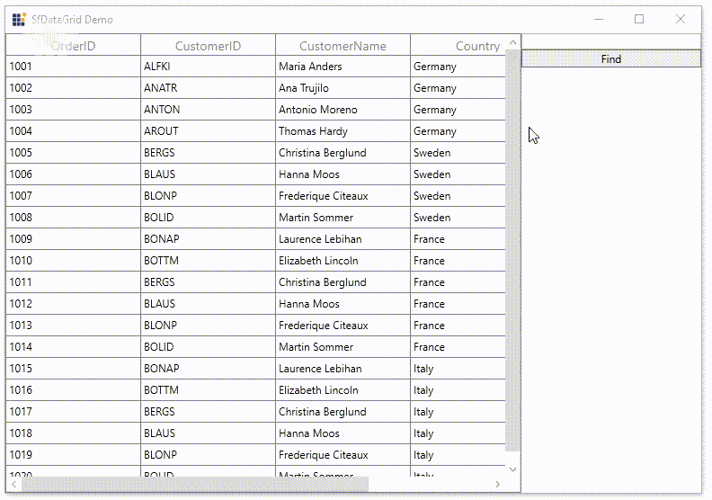

# How to Implement Equals Search Type in SearchController in WPF DataGrid?

This example illustrates how to implement Equals Search type in SearchController in [WPF DataGrid](https://www.syncfusion.com/wpf-controls/datagrid) (SfDataGrid).

`DataGrid` does not provide the support for [SearchType](https://help.syncfusion.com/cr/wpf/Syncfusion.UI.Xaml.Grid.SearchHelper.html#Syncfusion_UI_Xaml_Grid_SearchHelper_SearchType) property as Equals in [SearchHelper](https://help.syncfusion.com/cr/wpf/Syncfusion.UI.Xaml.Grid.SearchHelper.html). You can achieve this by override the [MatchSearchText](https://help.syncfusion.com/cr/wpf/Syncfusion.UI.Xaml.Grid.SearchHelper.html#Syncfusion_UI_Xaml_Grid_SearchHelper_MatchSearchText_Syncfusion_UI_Xaml_Grid_GridColumn_System_Object_) method in [SfDataGrid.SearchHelper](https://help.syncfusion.com/cr/wpf/Syncfusion.UI.Xaml.Grid.SfDataGrid.html#Syncfusion_UI_Xaml_Grid_SfDataGrid_SearchHelper). 

```C#
btnFind.Click += BtnFind_Click;

private void BtnFind_Click(object sender, RoutedEventArgs e)
{
    this.sfDataGrid.SearchHelper.ClearSearch();
    this.sfDataGrid.SearchHelper.FindNext(txtSearch.Text);
    this.sfDataGrid.SearchHelper = new SearchHelperExt(this.sfDataGrid);            
}

public class SearchHelperExt : SearchHelper
{
    public SearchHelperExt(SfDataGrid datagrid) : base(datagrid)
    {
         
    }

    protected override bool MatchSearchText(GridColumn column, object record)
    {        
         var cellvalue = Provider.GetFormattedValue(record, column.MappingName);
         
         if (!AllowCaseSensitiveSearch)
            return cellvalue != null && cellvalue.ToString().ToLower().Equals(SearchText.ToString().ToLower());
         else
            return cellvalue != null && cellvalue.ToString().Equals(SearchText.ToString());           
    }        
}
```

